```markdown
# 📐 RFC 001 — Arquitetura do Sistema "Nexus Siege"

> **Status:** Proposta  
> **Autor:** Arquiteto de Software  
> **Data:** 19 de Agosto de 2026  
> **Revisores:** Tech Lead, Game Designer, Product Owner  
> **Decisão:** Pendente de aprovação

---

## 📋 Índice

1. [Contexto e Motivação](#1-contexto-e-motivação)
2. [Resumo das Decisões](#2-resumo-das-decisões)
3. [Visão Geral da Arquitetura](#3-visão-geral-da-arquitetura)
4. [Backend (Go)](#4-backend-go)
5. [Frontend](#5-frontend)
6. [Comunicação](#6-comunicação)
7. [Fluxo de uma Partida](#7-fluxo-de-uma-partida)
8. [Modelo de Dados](#8-modelo-de-dados)
9. [Build e Distribuição](#9-build-e-distribuição)
10. [Riscos e Mitigações](#10-riscos-e-mitigações)
11. [Alternativas Consideradas](#11-alternativas-consideradas)
12. [Próximos Passos](#12-próximos-passos)
13. [Apêndices](#13-apêndices)

---

## 1. Contexto e Motivação

### 1.1 Problema

Precisamos definir a arquitetura técnica do jogo **Nexus Siege**, um híbrido de Tower Defense + RTS para navegador com as seguintes características:

- Partidas de 1 a 3 jogadores em tempo real
- Lógica de jogo determinística e sincronizada entre clientes
- Comunicação de baixa latência entre jogadores e servidor
- Interface responsiva e fluida (60fps ideal)
- Distribuição simplificada: **um único binário executável** contendo backend + frontend
- Suporte a modos solo (com pausa) e multiplayer competitivo

### 1.2 Restrições

| Restrição | Justificativa |
|---|---|
| Deve rodar em browser | Alcance máximo, sem instalação |
| Deve ser um executável único | Facilita distribuição e deploy |
| Deve suportar até 3 jogadores simultâneos | Escopo do MVP |
| Latência aceitável < 200ms | Experiência competitiva |
| Performance mínima de 30 FPS | Máquinas modestas |
| Sem dependências externas de runtime | Autossuficiência |

### 1.3 Objetivos

1. **Simplicidade de deploy:** Um único binário, zero configuração
2. **Performance:** 60fps no cliente, 30 ticks/s no servidor
3. **Consistência:** Servidor autoritativo, sem cheating possível
4. **Escalabilidade futura:** Arquitetura que permita crescer para mais jogadores/modos
5. **Manutenibilidade:** Código modular, testável, documentado

---

## 2. Resumo das Decisões

| Aspecto | Decisão | Justificativa |
|---|---|---|
| **Backend** | Go | Concorrência nativa (goroutines), compilação estática, performance adequada para game server |
| **Frontend (UI)** | HTML + HTMX + Go Templates | Simplicidade, reatividade sem JS complexo |
| **Frontend (Jogo)** | HTML5 Canvas + TypeScript | Renderização 60fps, controle fino |
| **Comunicação** | WebSocket + protocolo binário | Latência mínima para ações em tempo real |
| **Distribuição** | Binário único Go com assets embutidos (`go:embed`) | Deploy simplificado |
| **Banco de dados** | SQLite embutido | Sem dependências externas; suficiente para perfis e replays |
| **Autoridade** | Servidor autoritativo | Previne cheating e garante consistência |
| **Renderização** | Canvas 2D (MVP), WebGL (futuro) | Simplicidade inicial, performance adequada |
| **Protocolo** | Binário customizado (ou Protobuf) | Eficiência de banda |

---

## 3. Visão Geral da Arquitetura

### 3.1 Diagrama de Alto Nível

```mermaid
flowchart TB
    subgraph Cliente["🖥️ NAVEGADOR DO CLIENTE"]
        direction TB
        UI["HTMX + DOM<br/>(Menus, HUD, Painéis)"]
        Canvas["Canvas 2D<br/>(Renderização do jogo em 60fps)"]
        GameClient["Game Client (TypeScript)<br/>- Input handling<br/>- State interpolation<br/>- WebSocket client"]
        
        UI <-->|HTTP| Canvas
        Canvas <--> GameClient
    end
    
    subgraph Servidor["⚙️ SERVIDOR GO (binário único)"]
        direction TB
        HTTP["HTTP/HTMX Server<br/>(UI pages)"]
        WS["WebSocket Hub<br/>(rooms)"]
        GameServer["Game Server<br/>(autoritativo)"]
        
        GameLoop["Game Loop (tick-based)<br/>- Simulação (30 ticks/s)<br/>- Validação de comandos<br/>- Broadcast de snapshots"]
        
        SQLite["SQLite<br/>(perfis)"]
        Matchmaker["Matchmaker<br/>(lobbies)"]
        Replay["Replay Store<br/>(opcional)"]
        
        HTTP --> GameLoop
        WS --> GameLoop
        GameServer --> GameLoop
        
        GameLoop --> SQLite
        GameLoop --> Matchmaker
        GameLoop --> Replay
    end
    
    GameClient <-->|WebSocket (binário)| WS
    UI -->|HTTP| HTTP
    
    style Cliente fill:#e1f5ff,stroke:#0288d1,stroke-width:3px
    style Servidor fill:#fff4e1,stroke:#f57c00,stroke-width:3px
    style GameLoop fill:#ffe1e1,stroke:#d32f2f,stroke-width:2px
```

### 3.2 Separação de Responsabilidades

| Camada | Responsabilidade | Tecnologia |
|---|---|---|
| **Apresentação (UI)** | Menus, HUD, painéis, formulários | HTML + HTMX + CSS |
| **Renderização (Jogo)** | Mapa, unidades, torres, efeitos | Canvas 2D + TypeScript |
| **Lógica de Cliente** | Input, predição, interpolação | TypeScript |
| **Lógica de Servidor** | Simulação, validação, autoridade | Go |
| **Comunicação** | Mensagens cliente-servidor | WebSocket binário |
| **Persistência** | Perfis, stats, replays | SQLite |

### 3.3 Princípios de Design

1. **Servidor é autoridade:** Cliente nunca modifica estado diretamente
2. **Cliente é "burro":** Renderiza e envia inputs; não simula
3. **Protocolo mínimo:** Só trafega o essencial (comandos + snapshots delta)
4. **Estado é determinístico:** Mesmos inputs → mesmo resultado
5. **Assets embutidos:** Zero dependências externas no runtime

---

## 4. Backend (Go)

### 4.1 Estrutura de Pacotes

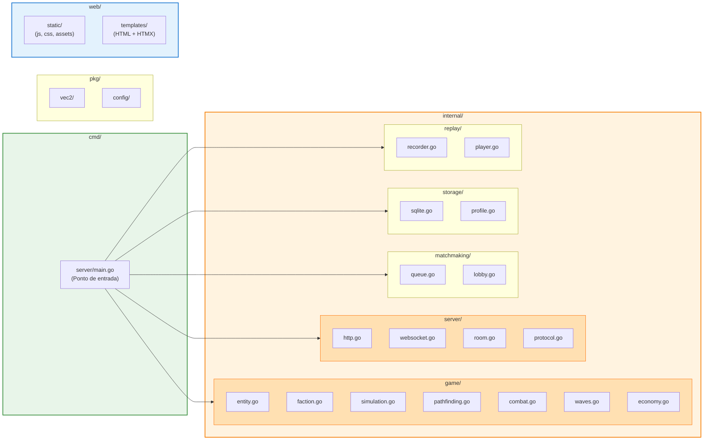

### 4.2 Game Loop Autoritativo

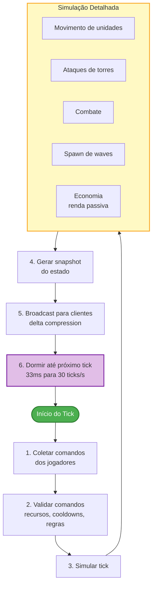

### 4.3 Modelo de Entidades

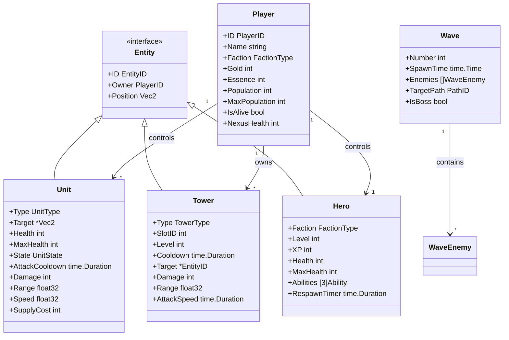

### 4.4 Estados de uma Unidade

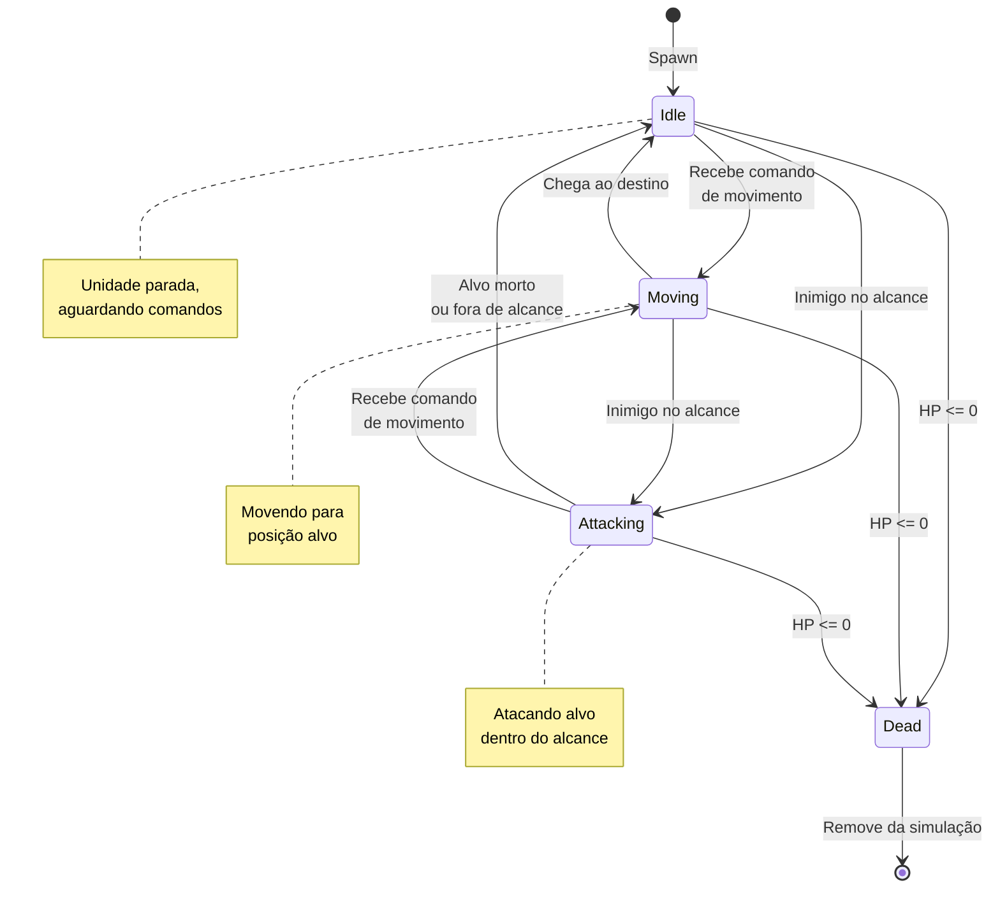

---

## 5. Frontend

### 5.1 Abordagem Híbrida

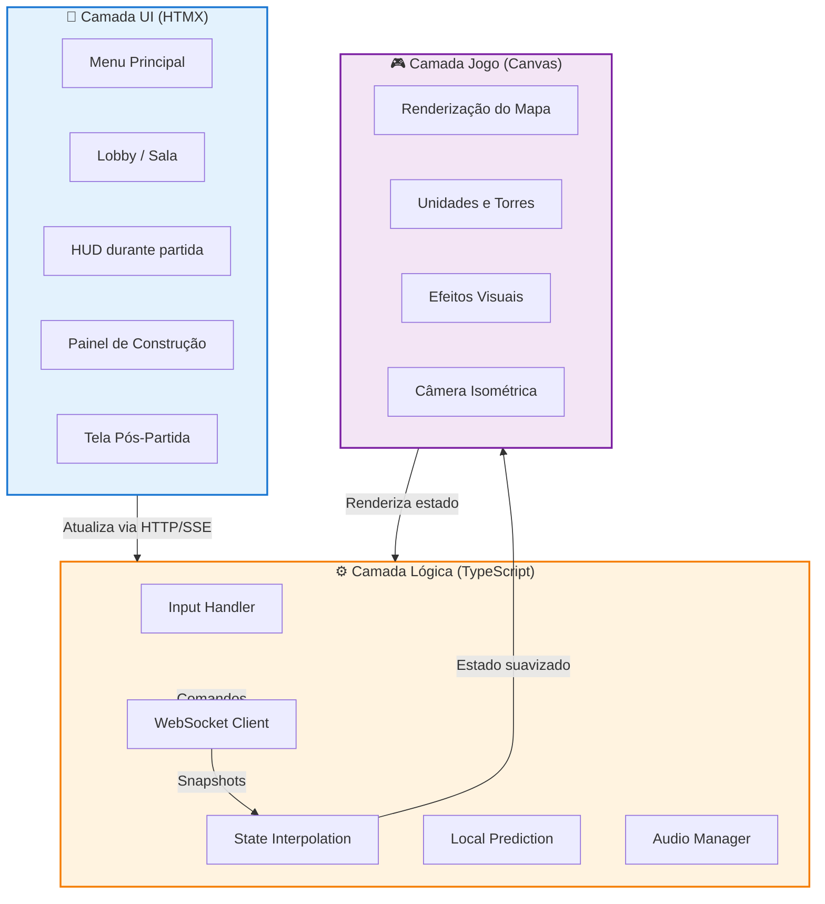

### 5.2 Estrutura do Cliente TypeScript

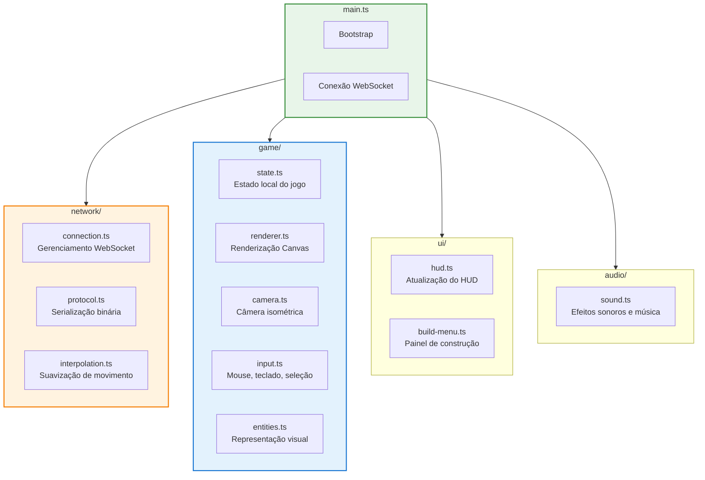

### 5.3 Pipeline de Renderização

```mermaid
flowchart LR
    Snapshot[Snapshot do Servidor<br/>10-15 Hz] --> Buffer[Buffer de<br/>Snapshots]
    Buffer --> Interp[Interpolação<br/>entre 2 últimos]
    Interp --> State[Estado Local<br/>suavizado]
    
    State --> Clear[Clear Canvas]
    Clear --> DrawMap[Desenhar Mapa]
    DrawMap --> DrawEntities[Desenhar Entidades<br/>torres, unidades]
    DrawEntities --> DrawEffects[Desenhar Efeitos<br/>projéteis, explosões]
    DrawEffects --> DrawUI[Desenhar UI<br/>seleção, health bars]
    DrawUI --> Present[Apresentar Frame<br/>60 FPS]
    
    Present --> State
    
    style Snapshot fill:#ffecb3,stroke:#ff8f00,stroke-width:2px
    style Present fill:#c8e6c9,stroke:#388e3c,stroke-width:2px
```

---

## 6. Comunicação

### 6.1 Protocolo de Mensagens

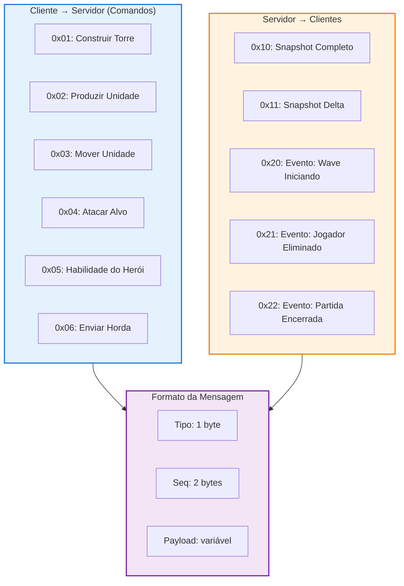

### 6.2 Fluxo de Dados com Latência

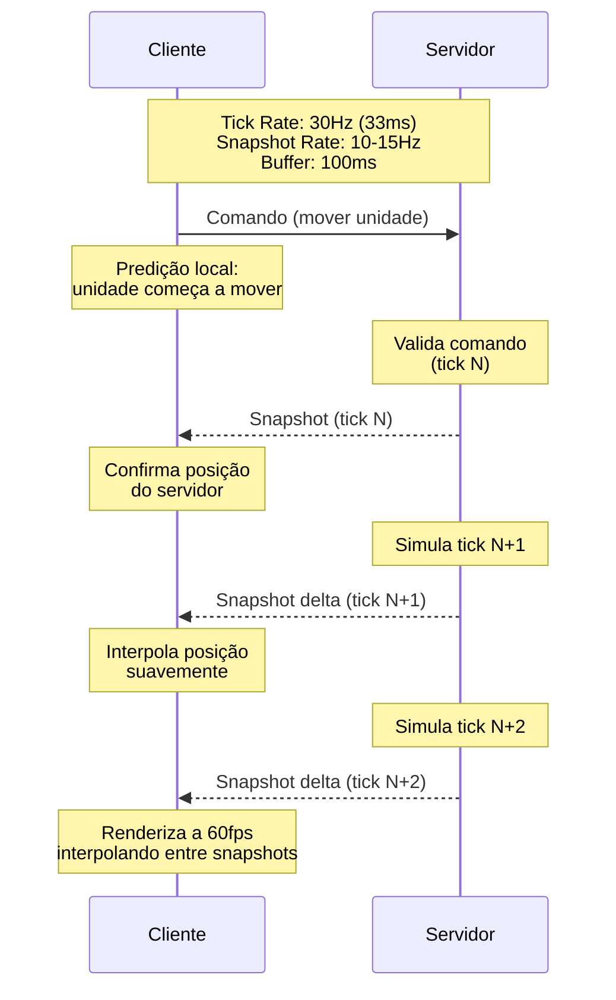

### 6.3 Compensação de Latência

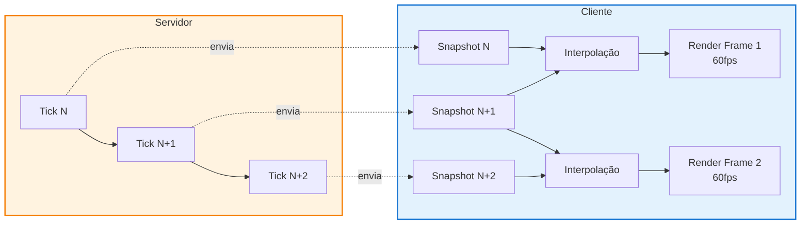

---

## 7. Fluxo de uma Partida

### 7.1 Sequência de Conexão

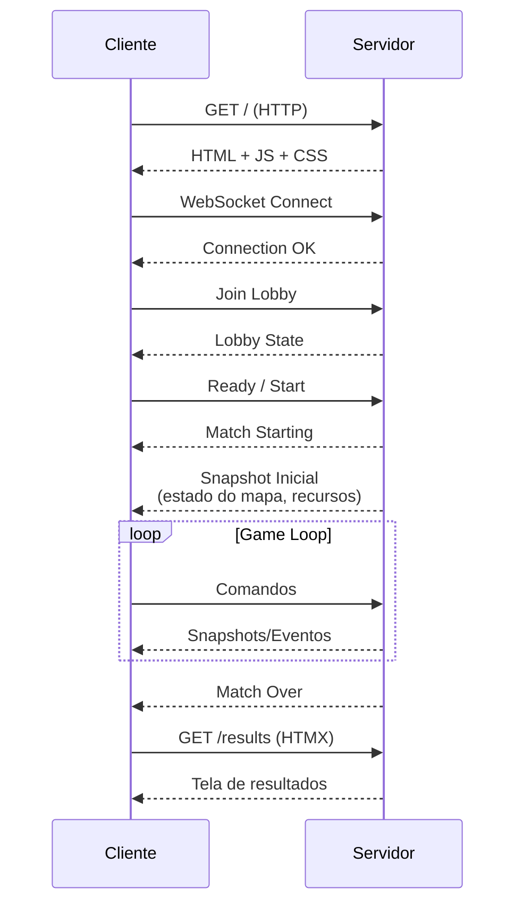

### 7.2 Ciclo de Vida de uma Partida

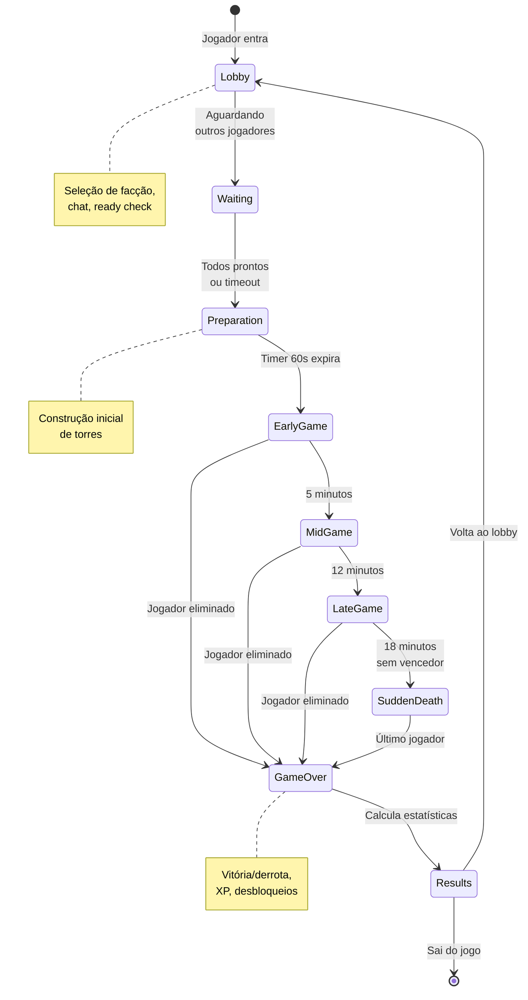

### 7.3 Gerenciamento de Salas

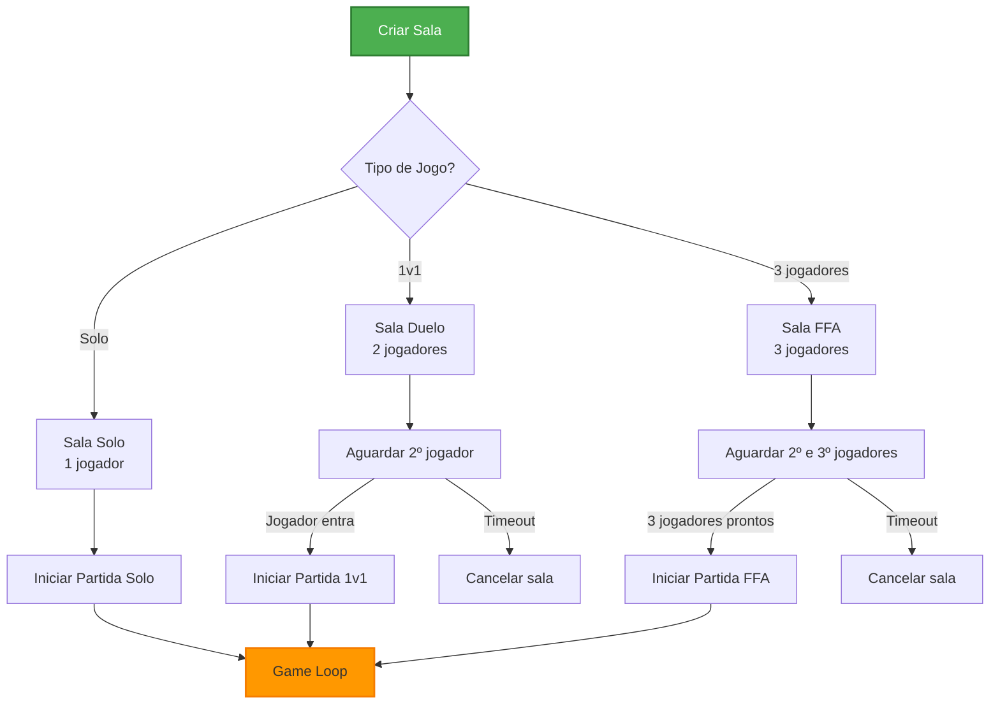

---

## 8. Modelo de Dados

### 8.1 Schema do Banco de Dados

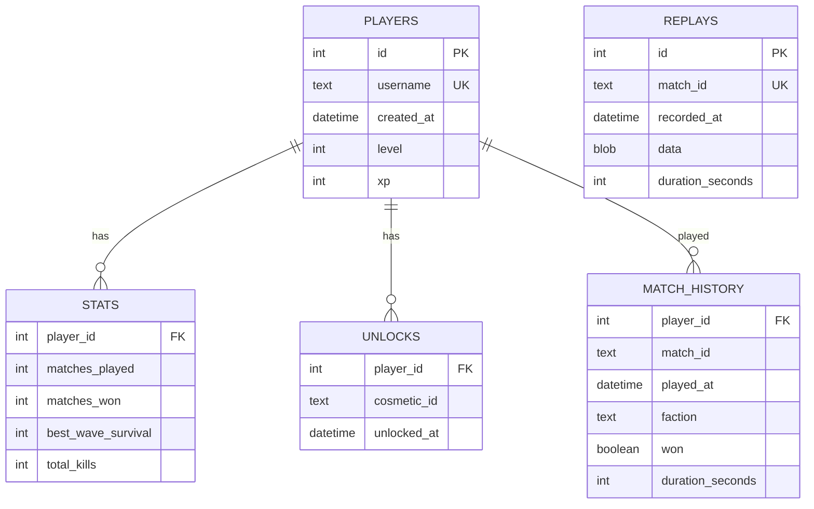

### 8.2 Fluxo de Persistência

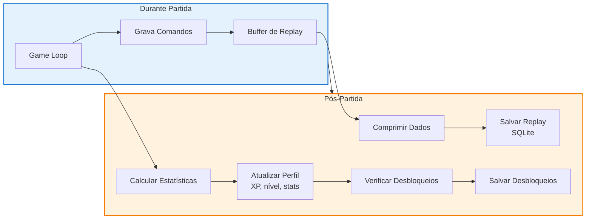
