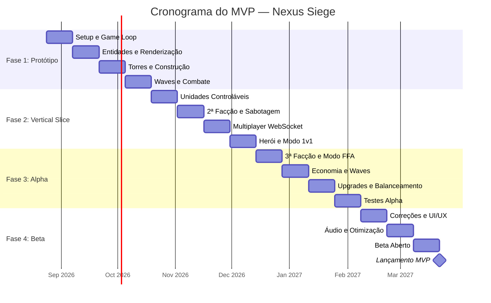
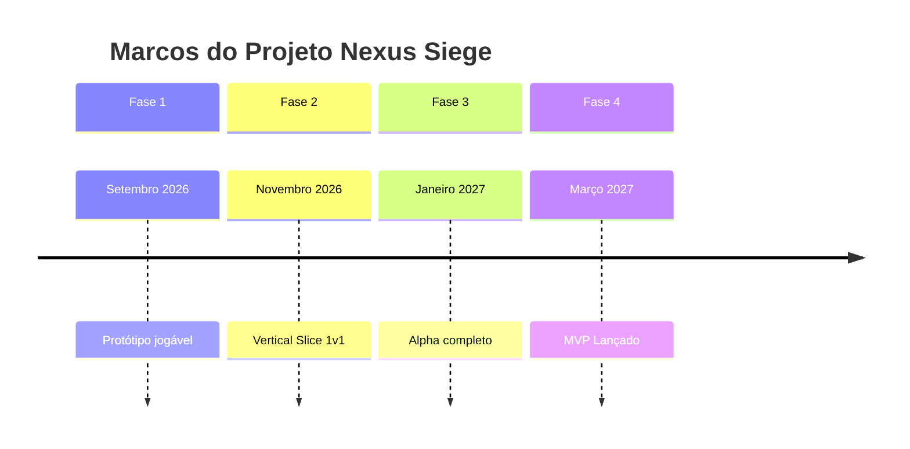

```markdown
# 📅 Plano de Entrega do MVP — Nexus Siege

> **Versão:** 1.0  
> **Data:** 19 de Agosto de 2026  
> **Status:** Em Planejamento  
> **Autor:** Tech Lead  
> **Duração Total Estimada:** 32 semanas (8 meses)  
> **Marco Final:** MVP pronto para distribuição

---

## 📋 Índice

1. [Objetivo e Critérios de Sucesso](#1-objetivo-e-critérios-de-sucesso)
2. [Visão Geral das Fases](#2-visão-geral-das-fases)
3. [Fase 1: Protótipo (Semanas 1-8)](#3-fase-1-protótipo-semanas-1-8)
4. [Fase 2: Vertical Slice (Semanas 9-16)](#4-fase-2-vertical-slice-semanas-9-16)
5. [Fase 3: Alpha (Semanas 17-24)](#5-fase-3-alpha-semanas-17-24)
6. [Fase 4: Beta/Polimento (Semanas 25-32)](#6-fase-4-betapolimento-semanas-25-32)
7. [Cronograma Visual](#7-cronograma-visual)
8. [Marcos e Entregas Intermediárias](#8-marcos-e-entregas-intermediárias)
9. [Riscos Específicos do Plano](#9-riscos-específicos-do-plano)
10. [Ferramentas e Processos](#10-ferramentas-e-processos)
11. [Entregáveis por Fase](#11-entregáveis-por-fase)
12. [Critério Final de Sucesso](#12-critério-final-de-sucesso)
13. [Próximos Passos Imediatos](#13-próximos-passos-imediatos)

---

## 1. Objetivo e Critérios de Sucesso

### 🎯 Objetivo

Entregar um MVP jogável em **32 semanas** com:

- ✅ 3 modos de jogo (sobrevivência solo, 1v1, 3 jogadores)
- ✅ 3 facções completas com identidade distinta
- ✅ Sistema de sabotagem funcional
- ✅ Multiplayer estável via WebSocket
- ✅ Binário único executável (sem dependências externas)
- ✅ Performance mínima de 30 FPS

### ✅ Definição de "MVP Pronto"

| Categoria | Critério | Como validar |
|---|---|---|
| **Modos** | 3 modos jogáveis | Testar cada modo do início ao fim |
| **Facções** | 3 facções completas (4 torres + 3 unidades + 1 herói cada) | Jogar uma partida completa com cada facção |
| **Gameplay** | Core loop funcionando: construir → defender → atacar → sabotar | Partida de 10-15 min sem bugs críticos |
| **Multiplayer** | 2-3 jogadores conectados, sincronizados | Jogar contra amigos sem dessincronização |
| **UI/UX** | Interface funcional: menus, HUD, painéis | Navegar por todas as telas sem confusão |
| **Performance** | 30+ FPS em máquina mediana, latência <200ms | Testar com 50+ unidades em tela |
| **Distribuição** | Binário único executável | Rodar em máquina limpa (Win/Linux/Mac) |
| **Polimento** | Áudio básico, feedback visual, sem crashes | Jogar 5 partidas seguidas sem crash |

### 📊 Métricas de Sucesso

| Métrica | Meta |
|---|---|
| Tempo médio de partida | 10-15 min (1v1), 15-20 min (FFA) |
| Taxa de crashes | < 1% das partidas |
| FPS médio | > 45 FPS |
| Latência média (multiplayer) | < 150ms |
| Satisfação dos beta testers | > 7/10 |
| Retenção (beta) | > 40% jogam 3+ partidas |

---

## 2. Visão Geral das Fases



### 📊 Resumo das Fases

| Fase | Duração | Objetivo Principal | Entregável Chave |
|---|---|---|---|
| **1: Protótipo** | 8 semanas | Validar core loop técnico | 1 jogador, 1 facção, waves básicas |
| **2: Vertical Slice** | 8 semanas | Validar gameplay completo | 1v1 com 2 facções, sabotagem, multiplayer |
| **3: Alpha** | 8 semanas | Conteúdo completo | Todos os modos, 3 facções, balanceamento |
| **4: Beta/Polimento** | 8 semanas | Qualidade de lançamento | MVP pronto para distribuição |

---

## 3. Fase 1: Protótipo (Semanas 1-8)

### 🎯 Objetivo

Provar que a arquitetura técnica funciona e o core loop é divertido.

### 📋 Tarefas Semanais

| Semana | Tarefa | Entregável | Critério de Sucesso |
|---|---|---|---|
| **1** | Setup do projeto Go + frontend | Repositório com estrutura de pastas, build funcionando | `go build` gera binário; `http://localhost:8080` carrega página |
| **2** | Game loop básico (servidor) | Servidor rodando tick a 30Hz, log de ticks | Servidor roda 1000 ticks sem crash |
| **3** | Sistema de entidades (torres, unidades) | Estruturas de dados para entidades | Criar/destruir entidades via comandos |
| **4** | Renderização Canvas (cliente) | Mapa básico com grid visível | Canvas renderiza 60fps com câmera |
| **5** | Construção de torres | Jogador clica em slot → torre aparece | Torre construída aparece no mapa e no HUD |
| **6** | Waves de inimigos (PvE) | Inimigos spawnam e seguem caminho | 5 waves automáticas com pathfinding A* |
| **7** | Combate básico | Torres atiram, inimigos morrem | Inimigos perdem vida ao passar por torres |
| **8** | Integração completa | Partida solo jogável do início ao fim | Sobreviver 10 waves sem crash |

### ✅ Marco da Fase 1

> **Protótipo jogável:** 1 jogador, 1 facção (Vanguarda de Ferro), 4 torres básicas, 10 waves de inimigos simples, sem herói, sem unidades controláveis.

### 🎯 Definição de "Pronto" (Fase 1)

- [ ] Binário executa sem dependências
- [ ] Partida solo dura 5+ minutos
- [ ] Torres construídas funcionam
- [ ] Inimigos seguem caminho e morrem
- [ ] FPS >30 com 30 inimigos em tela
- [ ] Zero crashes em 10 partidas seguidas

---

## 4. Fase 2: Vertical Slice (Semanas 9-16)

### 🎯 Objetivo

Validar o gameplay completo com multiplayer e sabotagem.

### 📋 Tarefas Semanais

| Semana | Tarefa | Entregável | Critério de Sucesso |
|---|---|---|---|
| **9** | Sistema de unidades controláveis | Jogador produz e move unidades | Unidade anda até posição clicada |
| **10** | Combate entre unidades | Unidades atacam inimigas | DPS calculado corretamente, mortes funcionam |
| **11** | Segunda facção (Enxame Voraz) | 4 torres + 3 unidades da facção 2 | Jogar partida completa com Enxame |
| **12** | Sistema de sabotagem | Enviar hordas para adversário | Horda aparece na base inimiga após envio |
| **13** | Multiplayer WebSocket | 2 jogadores conectados em mesma sala | Ambos veem o mesmo estado do jogo |
| **14** | Sincronização e interpolação | Movimento suave entre snapshots | Sem "teleporte" de unidades, latência <200ms |
| **15** | Modo 1v1 completo | Duelo com vitória/derrota | Partida 1v1 do início ao fim |
| **16** | Herói básico | 1 herói por facção com habilidades | Herói sobe de nível e usa habilidade |

### ✅ Marco da Fase 2

> **Vertical slice:** 1v1 funcional com 2 facções, sabotagem ativa, herói jogável, multiplayer estável.

### 🎯 Definição de "Pronto" (Fase 2)

- [ ] 2 jogadores jogam 1v1 sem dessincronização
- [ ] Sabotagem funciona (enviar horda causa dano)
- [ ] Herói sobe de nível e usa habilidade
- [ ] Partida 1v1 dura 10-15 min
- [ ] Reconexão após disconnect funciona
- [ ] Zero dessincronizações em 20 partidas

---

## 5. Fase 3: Alpha (Semanas 17-24)

### 🎯 Objetivo

Conteúdo completo com todas as facções e modos.

### 📋 Tarefas Semanais

| Semana | Tarefa | Entregável | Critério de Sucesso |
|---|---|---|---|
| **17** | Terceira facção (Círculo Arcano) | 4 torres + 3 unidades da facção 3 | Jogar partida completa com Arcano |
| **18** | Modo 3 jogadores | Free-for-all com 3 bases | 3 jogadores jogam sem bugs |
| **19** | Modo sobrevivência (solo) | Waves infinitas, high score | Leaderboard local funciona |
| **20** | Sistema de economia completo | Ouro + Essência, upgrades | Recursos acumulam e gastam corretamente |
| **21** | Waves neutras balanceadas | 8 tipos de inimigos + 2 bosses | Dificuldade escala corretamente |
| **22** | Upgrades de torre (níveis 1-3) | Torres melhoráveis | Torres ficam visivelmente mais fortes |
| **23** | Balanceamento inicial | Ajustes de DPS/custo/velocidade | Nenhuma facção domina as outras |
| **24** | Testes internos (alpha testers) | Feedback de 5-10 jogadores | Lista de bugs e sugestões priorizada |

### ✅ Marco da Fase 3

> **Alpha completo:** Todos os modos, 3 facções, economia funcional, balanceamento inicial, feedback de alpha testers coletado.

### 🎯 Definição de "Pronto" (Fase 3)

- [ ] 3 facções jogáveis com identidade distinta
- [ ] 3 modos de jogo funcionais
- [ ] Economia balanceada (não quebra após 10 min)
- [ ] 8 tipos de inimigos + 2 bosses
- [ ] Feedback de alpha testers documentado
- [ ] Lista de bugs críticos zerada

---

## 6. Fase 4: Beta/Polimento (Semanas 25-32)

### 🎯 Objetivo

Qualidade de lançamento, polimento e distribuição.

### 📋 Tarefas Semanais

| Semana | Tarefa | Entregável | Critério de Sucesso |
|---|---|---|---|
| **25** | Correção de bugs do alpha | Bugs críticos resolvidos | Zero bugs críticos em lista |
| **26** | Polimento de UI/UX | Menus, HUD, feedback visual | Interface intuitiva, sem confusão |
| **27** | Áudio completo | Música + SFX essenciais | Cada ação tem feedback sonoro |
| **28** | Otimização de performance | Culling, compressão de assets | 60fps com 100 unidades em tela |
| **29** | Testes de stress | 3 jogadores + 100 unidades | Servidor aguenta sem lag |
| **30** | Documentação | Tutorial, FAQ, controles | Novo jogador entende em 5 min |
| **31** | Beta aberto (20-30 testers) | Feedback final | Lista de ajustes finais |
| **32** | Lançamento MVP | Binário final + página de download | MVP pronto para distribuição |

### ✅ Marco da Fase 4

> **MVP lançado:** Binário único funcional, polido, documentado, testado por beta testers, pronto para distribuição.

### 🎯 Definição de "Pronto" (Fase 4)

- [ ] Binário único executável (<100MB)
- [ ] Roda em Windows, Linux, Mac
- [ ] Tutorial completo para novos jogadores
- [ ] Zero crashes em 50 partidas seguidas
- [ ] Feedback de beta testers incorporado
- [ ] Página de download/documentação online

---

## 7. Cronograma Visual

```
2026        Ago    Set    Out    Nov    Dez    Jan    Fev    Mar 2027
            ┌──────┬──────┬──────┬──────┬──────┬──────┬──────┬──────┐
Fase 1      │██████│██████│      │      │      │      │      │      │
Protótipo   │  S1  │  S2  │      │      │      │      │      │      │
            ├──────┼──────┼──────┼──────┤      │      │      │      │
Fase 2      │      │      │██████│██████│      │      │      │      │
Vert.Slice  │      │      │  S3  │  S4  │      │      │      │      │
            │      │      │      │      ├──────┼──────┤      │      │
Fase 3      │      │      │      │      │██████│██████│      │      │
Alpha       │      │      │      │      │  S5  │  S6  │      │      │
            │      │      │      │      │      │      ├──────┼──────┤
Fase 4      │      │      │      │      │      │      │██████│██████│
Beta/Lanç.  │      │      │      │      │      │      │  S7  │  S8  │
            └──────┴──────┴──────┴──────┴──────┴──────┴──────┴──────┘
            
Marco 1: Protótipo jogável (fim de Setembro 2026)
Marco 2: Vertical slice 1v1 (fim de Novembro 2026)
Marco 3: Alpha completo (fim de Janeiro 2027)
Marco 4: MVP lançado (fim de Março 2027)
```

### 📅 Marcos-Chave



---

## 8. Marcos e Entregas Intermediárias

Para manter o momentum, cada fase tem **entregas quinzenais**:

| Fase | Entrega | Data | Descrição |
|---|---|---|---|
| **1** | Build funcional | S2 | Binário roda e serve página |
| **1** | Torres construíveis | S5 | Clicar em slot → torre aparece |
| **1** | Inimigos andam | S6 | Pathfinding A* funcionando |
| **1** | **Protótipo jogável** | **S8** | **10 waves sobrevivíveis** |
| **2** | Unidades controláveis | S10 | Produzir e mover unidades |
| **2** | Multiplayer básico | S13 | 2 jogadores conectados |
| **2** | **Vertical slice** | **S16** | **1v1 completo com sabotagem** |
| **3** | 3ª facção jogável | S18 | Círculo Arcano completo |
| **3** | 3 jogadores | S19 | Modo FFA funcional |
| **3** | **Alpha completo** | **S24** | **Todos modos, balanceamento** |
| **4** | Áudio completo | S27 | Música + SFX |
| **4** | Beta aberto | S31 | 20-30 testers externos |
| **4** | **MVP lançado** | **S32** | **Binário final + docs** |

---

## 9. Riscos Específicos do Plano

| Risco | Probabilidade | Impacto | Mitigação |
|---|---|---|---|
| **Multiplayer dessincroniza** | Alta | Crítico | Dedicar 2 semanas extras na Fase 2 para testes de rede; ter fallback (modo solo) |
| **Balanceamento impossível** | Média | Alto | Começar balanceamento na Fase 3, não deixar para o final; usar planilha desde o início |
| **Performance ruim com muitas unidades** | Média | Alto | Testar performance desde Fase 1; ter plano B (reduzir max unidades) |
| **Escopo expande (feature creep)** | Alta | Alto | Manter lista de "não faz no MVP" rigorosa; revisar escopo a cada 2 semanas |
| **Burnout do desenvolvedor** | Média | Crítico | Pausas planejadas (1 semana a cada 8); celebrar marcos; manter diversão |
| **Assets (sprites/áudio) atrasam** | Média | Médio | Usar placeholders (quadrados coloridos) até Fase 4; assets finais só no final |
| **HTMX não atende HUD em tempo real** | Baixa | Médio | Usar WebSocket + DOM direto para HUD crítico; HTMX só para UI estática |
| **SQLite não escala** | Baixa | Médio | Monitorar performance; migrar para PostgreSQL só se necessário (pós-MVP) |

### 🚨 Plano de Contingência

Se alguma fase atrasar mais de 2 semanas:

1. **Revisar escopo:** cortar features não-críticas
2. **Redistribuir tempo:** mover tarefas para fase seguinte
3. **Adicionar buffer:** Fase 4 já tem 2 semanas de margem
4. **Comunicar stakeholders:** ajustar expectativas

---

## 10. Ferramentas e Processos

### 🛠️ Gestão de Tarefas

- **Kanban simples** (Trello, Notion, ou GitHub Projects)
- Colunas: `Backlog` → `To Do` → `In Progress` → `Testing` → `Done`
- Cada tarefa tem:
  - Título claro
  - Descrição detalhada
  - Estimativa (horas)
  - Prioridade (P0, P1, P2)
  - Assignee

### 🔀 Controle de Versão

- **Git** com fluxo simplificado:
  - `main` (sempre estável, pronto para build)
  - `develop` (integração de features)
  - `feature/nome-da-feature` (desenvolvimento)
  - `hotfix/nome-do-bug` (correções urgentes)
- Commits atômicos e mensagens claras (Conventional Commits)
- PRs obrigatórios para `main` e `develop`

### 🧪 Testes

| Tipo | Quando | Ferramenta |
|---|---|---|
| **Unitários** | Durante desenvolvimento | Go `testing` + `testify` |
| **Integração** | A cada feature | Go `testing` + servidor real |
| **E2E (manual)** | A cada marco | Jogar partidas completas |
| **Performance** | Fase 3 e 4 | Profiling (pprof, Chrome DevTools) |
| **Stress** | Fase 4 | Múltiplos clientes simultâneos |

### 📊 Feedback

- **Alpha testers (Fase 3):** 5-10 amigos/colegas, sessão de 1h com observação
- **Beta testers (Fase 4):** 20-30 jogadores, formulário de feedback estruturado
- **Métricas coletadas:**
  - Tempo de partida
  - Taxa de vitória por facção
  - Bugs reportados
  - NPS (Net Promoter Score)

### 📝 Reuniões

| Reunião | Frequência | Duração | Participantes |
|---|---|---|---|
| **Daily standup** | Diária (opcional) | 15 min | Dev |
| **Review quinzenal** | A cada 2 semanas | 1h | Dev + stakeholders |
| **Retrospectiva de fase** | Fim de cada fase | 2h | Dev + stakeholders |
| **Playtest** | Fim de cada fase | 2-3h | Testers |

---

## 11. Entregáveis por Fase

### 📦 Fase 1: Protótipo

```
nexus-siege-v0.1.0/
├── nexus-siege.exe (binário único)
├── README.md (como rodar)
└── demo.mp4 (vídeo de 2min mostrando o protótipo)
```

### 📦 Fase 2: Vertical Slice

```
nexus-siege-v0.2.0/
├── nexus-siege.exe
├── README.md
├── CHANGELOG.md (o que mudou desde v0.1)
└── gameplay-1v1.mp4 (vídeo de partida 1v1)
```

### 📦 Fase 3: Alpha

```
nexus-siege-v0.3.0/
├── nexus-siege.exe
├── README.md
├── CHANGELOG.md
├── BALANCE_NOTES.md (notas de balanceamento)
├── alpha-feedback.md (resumo do feedback)
└── gameplay-3players.mp4 (vídeo de partida 3 jogadores)
```

### 📦 Fase 4: MVP

```
nexus-siege-v1.0.0/
├── nexus-siege.exe (Windows, Linux, Mac)
├── README.md (guia completo)
├── CHANGELOG.md
├── TUTORIAL.md (como jogar)
├── FAQ.md
├── site/ (página de download simples)
└── trailer.mp4 (vídeo de lançamento)
```

---

## 12. Critério Final de Sucesso

O MVP é considerado **entregue com sucesso** quando:

### ✅ Checklist Final

- [ ] **Funcionalidade:** Todos os modos (solo, 1v1, 3 jogadores) jogáveis do início ao fim
- [ ] **Conteúdo:** 3 facções completas com identidade distinta
- [ ] **Qualidade:** Zero bugs críticos, performance estável (30+ FPS)
- [ ] **Experiência:** Novo jogador consegue jogar sem tutorial externo
- [ ] **Distribuição:** Binário único funciona em máquina limpa
- [ ] **Validação:** 20+ beta testers confirmam que é divertido
- [ ] **Documentação:** README, tutorial e FAQ completos
- [ ] **Comunidade:** Página online com download e informações

### 🎯 Definição de "Sucesso"

> O MVP é um sucesso se, após o lançamento, pelo menos **30% dos beta testers** jogarem 5+ partidas e recomendarem o jogo para amigos.

---

## 13. Próximos Passos Imediatos

Para começar **hoje**:

### 🚀 Semana 1 — Setup Inicial

- [ ] **Criar repositório Git** com estrutura de pastas da RFC
- [ ] **Setup do Go** com `go.mod` e dependências básicas
- [ ] **Setup do frontend** com HTML + HTMX + TypeScript
- [ ] **Primeiro build:** binário que serve "Hello World" em `http://localhost:8080`
- [ ] **Criar board Kanban** com tarefas das primeiras 2 semanas
- [ ] **Definir convenções** de código (linting, formatação, commits)

### 📋 Tarefas da Semana 1 (Detalhadas)

| # | Tarefa | Estimativa | Prioridade |
|---|---|---|---|
| 1 | Criar repositório GitHub | 1h | P0 |
| 2 | Setup `go.mod` com dependências (gorilla/websocket, etc.) | 2h | P0 |
| 3 | Estrutura de pastas conforme RFC | 2h | P0 |
| 4 | `main.go` com servidor HTTP básico | 3h | P0 |
| 5 | `go:embed` para assets frontend | 2h | P0 |
| 6 | HTML + HTMX + TypeScript setup | 3h | P0 |
| 7 | Build cross-platform (Windows, Linux, Mac) | 2h | P1 |
| 8 | README.md com instruções | 1h | P1 |
| 9 | Board Kanban criado | 1h | P1 |
| 10 | Primeiro commit e push | 30min | P0 |

**Total estimado:** ~17 horas (2 dias de trabalho focado)

---

## 📎 Anexos

### A. Lista de "Não Faz no MVP"

Para evitar feature creep, estas features **NÃO** estão no escopo do MVP:

- ❌ Editor de mapas
- ❌ Modo campanha completo (apenas mapas avulsos)
- ❌ Ranked e temporadas
- ❌ Sistema de replay visual (apenas gravação de comandos)
- ❌ Suporte mobile
- ❌ Mais de 3 facções
- ❌ Torneios e modos customizados
- ❌ Chat de voz
- ❌ Integração com redes sociais
- ❌ Loja de cosméticos (apenas desbloqueio por gameplay)

### B. Dependências Externas

| Dependência | Versão | Uso |
|---|---|---|
| Go | 1.22+ | Backend |
| gorilla/websocket | latest | WebSocket |
| mattn/go-sqlite3 | latest | SQLite (ou pure Go alternative) |
| HTMX | 1.9+ | UI reativa |
| TypeScript | 5.x | Cliente |
| Vite | 5.x | Build frontend |

### C. Referências

- [GDD — Nexus Siege](./GDD.md)
- [RFC 001 — Arquitetura do Sistema](./RFC-001-arquitetura.md)
- [RFC 002 — Protocolo Binário](./RFC-002-protocolo.md) (futura)

---

## ✅ Aprovação

| Papel | Nome | Data | Assinatura |
|---|---|---|---|
| Product Owner | _________ | ___/___/___ | _________ |
| Tech Lead | _________ | ___/___/___ | _________ |
| Game Designer | _________ | ___/___/___ | _________ |

---

> **Próximo passo:** Após aprovação deste plano, iniciar **Semana 1** com setup do repositório e primeiro build funcional.
```

Este plano está pronto para ser salvo como arquivo `.md` e usado como guia de execução do projeto. Quer que eu crie também:

- **Template de feedback para alpha/beta testers**
- **Lista detalhada de tarefas da Fase 1 com estimativas por hora**
- **Checklist de testes para cada marco**
- **Plano de comunicação para beta testers**